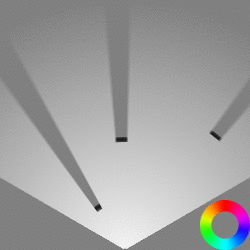
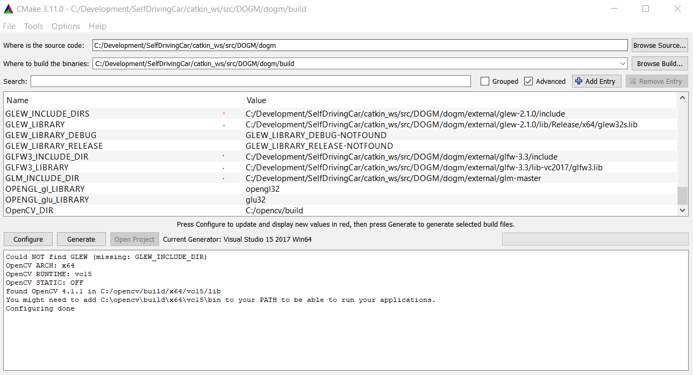

[](https://opensource.org/licenses/MIT)  

# DISCLAIMER

This repository is still WIP and in a pretty early stage. Contributions are kindly appreciated :)


# [WIP] A Random Finite Set Approach for Dynamic Occupancy Grid Maps with Real-Time Application

Implementation of [A Random Finite Set Approach for Dynamic Occupancy Grid Maps with Real-Time Application](https://arxiv.org/abs/1605.02406)

<p align="center">
  
  
</p>

## Performance

|             | Particle count | Birth particle count | Grid cell count* |  Time  |        GPU**        |
|-------------|:--------------:|:--------------------:|:----------------:|:------:|:-------------------:|
|     Ours    |     3 * 10⁵    |        3 * 10⁴       |    6.25 * 10⁴    | 156 ms | NVIDIA Quadro P2000 |
| Nuss et al. |     2 * 10⁶    |        2 * 10⁵       |    1.44 * 10⁶    |  50 ms |    NVIDIA GTX 980   |

\* increasing the grid cell count to the one in the paper increases the runtime by only ~20ms

\** the NVIDIA GTX 980 is more than twice as fast as the NVIDIA Quadro P2000

## Requirements and Setup
You need OpenCV, OpenGL, GLFW3, GLEW, GLM and CUDA to compile and run this project. You can find the setup instructions for Ubuntu 18.04 LTS and Windows 10 below.

<details>
<summary>Ubuntu 18.04</summary>
  
- OpenCV: recommended to compile from source following the [official instructions](https://docs.opencv.org/master/d7/d9f/tutorial_linux_install.html).
- GLFW3, GLEW, GLM:
    ```console
    sudo apt install libglfw3-dev libglew-dev libglm-dev
    ```
- CUDA:
  - Have the most recent nvidia driver installed on your system, then check which CUDA version it supports
      ```console
      nvidia-smi -q | grep CUDA
      ```
  - Follow the corresponding instructions from the [cuda toolkit archive](https://developer.nvidia.com/cuda-toolkit-archive)
  - Update environment variables in your `bashrc` (or equivalent rc file)
      ```console
      echo "\n# CUDA paths\nexport PATH=$PATH:/usr/local/cuda/bin\nexport CUDADIR=/usr/local/cuda\nexport LD_LIBRARY_PATH=$LD_LIBRARY_PATH:/usr/local/cuda/lib64\n" >> ~/.bashrc
      ```
  - Reboot (if necessary, a couple of times)
  - Check that your system GPU driver is still working by executing `nvidia-smi`
  - To verify that your CUDA installation is working, consider compiling and running one of the examples from /usr/local/cuda/samples. In particular ones that use OpenGL+CUDA, e.g. `samples/2_Graphics/Mandelbrot`.
</details>

<details>
<summary>Windows 10</summary>
  
- OpenCV:
  - Download and install OpenCV Windows from [here](https://opencv.org/releases/).

- GLFW3, GLEW, GLM:
  - It is recommended to place all packages in a folder ```dogm/external```
    - Download [GLFW3 64-bit Windows binary](https://www.glfw.org/download.html), [GLEW binaries](http://glew.sourceforge.net/) and [GLM](https://github.com/g-truc/glm/releases)
    - Unzip all of them in the ```dogm/external``` folder.

  - In the end you should have a folder structure that's something like this:
    - ```dogm/external/glew-2.1.0```
    - ```dogm/external/glfw-3.3```
    - ```dogm/external/glm```

- CUDA:
  - Have the most recent nvidia driver installed on your system, then check which CUDA version it supports
  - Follow the corresponding instructions from the [cuda toolkit archive](https://developer.nvidia.com/cuda-toolkit-archive)

</details>

## How to build

Use CMake to build the project:

<details>
<summary>Ubuntu 18.04</summary>

```
cd dogm
mkdir build
cd build
cmake ..
make
```
</details>

<details>
<summary>Windows 10</summary>

On Windows it's easiest to use cmake-gui. Use it to configure and generate the project like shown below (required variables are marked with a red dot):

<p align="center">
  
</p>

Afterwards open the generated ```.sln``` in Visual Studio 17/19 and compile it.
</details>

## Contributing

Contributions are welcome. Please make sure to apply `clang-format` to your code, e.g. by manually executing

```console
find dogm/include dogm/src dogm/demo -iname '*.h' -o -iname '*.cpp' -o -iname '*.cu' | xargs clang-format -i
```

or including this formatting in your editor/IDE.

## References

Nuss et al. ["A Random Finite Set Approach for Dynamic Occupancy Grid Maps with Real-Time Application"](https://arxiv.org/abs/1605.02406)

Dominik Nuß. ["A Random Finite Set Approach for Dynamic Occupancy Grid Maps"](https://d-nb.info/1133544290/34)

Homm et al. ["Efficient Occupancy Grid Computation on the GPU with Lidar and Radar for Road Boundary Detection"](https://mediatum.ub.tum.de/doc/1287438/726193.pdf)

[mitkina/dogma](https://github.com/mitkina/dogma) has also been a great reference whenever I got stuck.
