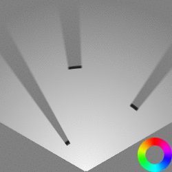

[](https://opensource.org/licenses/MIT)  

# DISCLAIMER

This repository is still WIP and in a pretty early stage. Contributions are kindly appreciated :)


# [WIP] A Random Finite Set Approach for Dynamic Occupancy Grid Maps with Real-Time Application

Implementation of [A Random Finite Set Approach for Dynamic Occupancy Grid Maps with Real-Time Application](https://arxiv.org/abs/1605.02406)

<p align="center">
  
  
</p>

## Requirements

- CMake
- OpenCV
- OpenGL, GLFW3, GLEW, GLM
- CUDA

## How to build and run

Use CMake to build the project:

```
cd dogm
mkdir build
cd build
cmake ..
make
```

## References

Nuss et al. ["A Random Finite Set Approach for Dynamic Occupancy Grid Maps with Real-Time Application"](https://arxiv.org/abs/1605.02406)

Dominik Nuß. ["A Random Finite Set Approach for Dynamic Occupancy Grid Maps"](https://d-nb.info/1133544290/34)

Homm et al. ["Efficient Occupancy Grid Computation on the GPU with Lidar and Radar for Road Boundary Detection"](https://mediatum.ub.tum.de/doc/1287438/726193.pdf)

[mitkina/dogma](https://github.com/mitkina/dogma) has also been a great reference whenever I got stuck.
